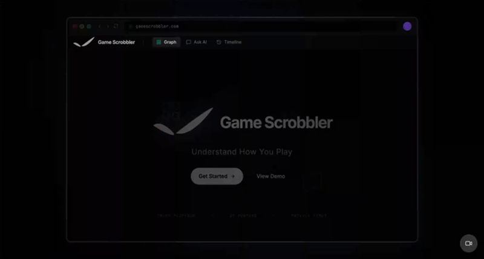
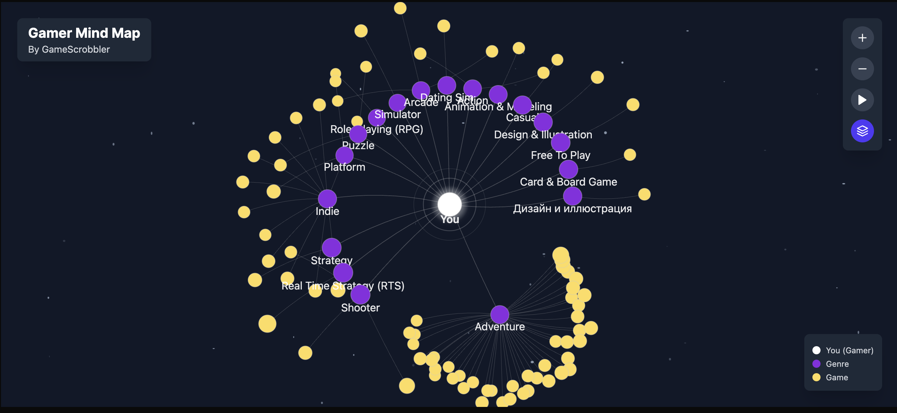
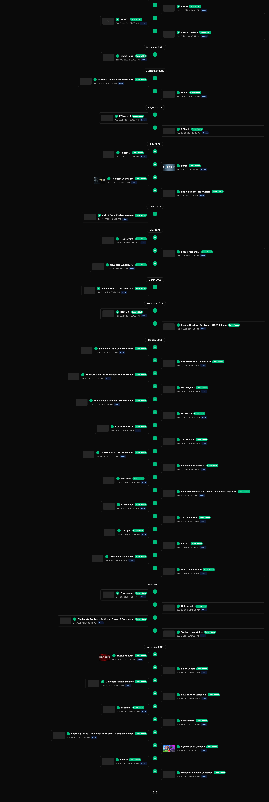
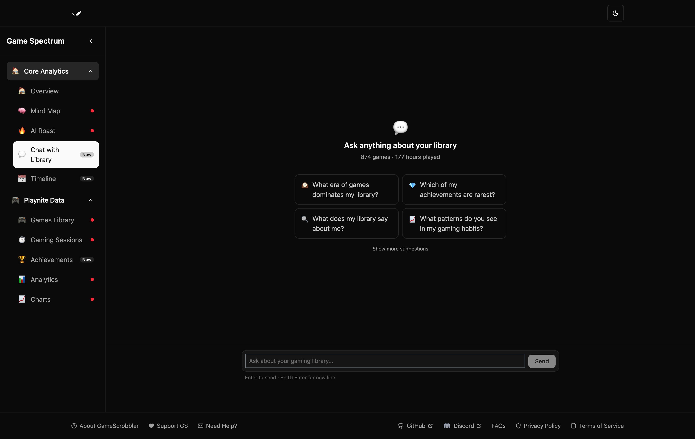
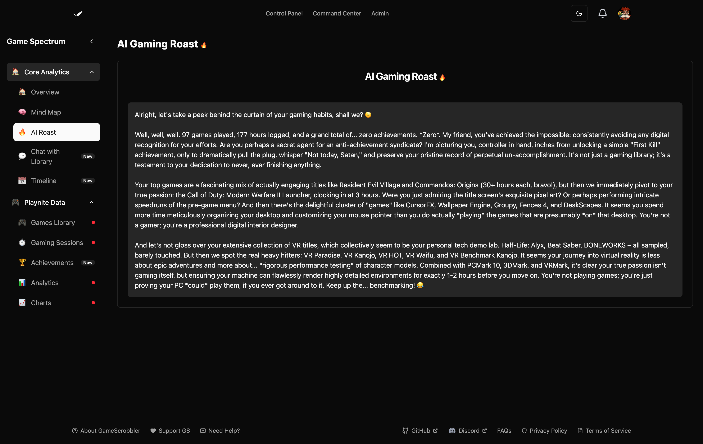

# GameScrobbler — Playnite Plugin

Visualize your gaming history in Playnite.

GameScrobbler is a Playnite plugin for tracking, analyzing, and visualizing your gaming habits. It transforms your Playnite library into interactive analytics, visual maps, and AI-powered insights.

Instead of a static list of games, your library becomes a living profile of how you actually play.

<p align="center">
  <a href="https://www.youtube.com/watch?v=aIkQVpO8NoA">
    
  </a>
</p>

---

## Install

### Install from Playnite (recommended)

1. Open Playnite
2. Go to Addons -> Browse
3. Search `GameScrobbler`
4. Click **Install**

---

### Manual installation

Download the latest release:

https://github.com/game-scrobbler/gs-playnite/releases/latest

Then install the `.pext` package via:

`Playnite -> Addons -> Install from file`

---

## Features

### Gamer Mind Map

A visual graph of your gaming library centered around you.

Genres form clusters around your profile, with games orbiting those genres. This reveals patterns in how you play.

You can quickly see:

- dominant genres in your library
- hidden play patterns
- how large your backlog really is

---

### Play Timeline

Track your gaming sessions over time.

See when you were most active, which games dominated specific periods, and how your habits evolve.

---

### Chat With Your Library

Ask questions about your gaming habits.

Examples:

- What genre do I play the most?
- Which games did I abandon halfway?
- What should I finish next?

GameScrobbler analyzes your library and returns answers based on your real play history.

---

### AI Roast

GameScrobbler can generate humorous commentary about your gaming habits.

Example:

You own 287 games.  
You have finished 19.  
Your backlog now qualifies as a museum.

---

## Screenshots

### Gamer Mind Map



### Play Timeline



### Chat With Library



### AI Roast



---

## Core Capabilities

- automatic game session tracking
- Playnite library synchronization
- optional achievement tracking
- interactive statistics dashboard
- AI analysis of gaming behavior
- account linking for persistent data
- configurable privacy controls

---

## How It Works

GameScrobbler listens to Playnite game events and records play sessions automatically.

Your library metadata and play history are synced to your GameScrobbler account where additional analysis and visualizations are generated.

These insights are then displayed inside Playnite through an embedded dashboard.

---

## Achievement Sync

GameScrobbler can aggregate achievement progress from multiple Playnite addons.

Supported providers:

- [SuccessStory](https://playnite.link/addons.html#Success_Story_Addon)
- [Playnite Achievements](https://playnite.link/addons.html#PlayniteAchievements_e6aad2c9-6e06-4d8d-ac55-ac3b252b5f7b)

The plugin checks providers in priority order and uses the first one that returns data.

If neither addon is installed, achievement fields are sent as unknown, not zero.

You can disable achievement sync in:

`Settings -> Experimental Features -> Sync achievement data`

---

## Privacy

Users control their data.

Settings allow you to:

- disable scrobbling
- disable error reporting
- disable achievement syncing

All options are configurable inside the plugin settings.

---

## Development

### Requirements

- .NET Framework 4.6.2
- Playnite SDK
- Visual Studio / MSBuild

---

### Build

```bash
MSBuild.exe GsPlugin.sln -p:Configuration=Release -restore
```

---

### Tests

```bash
dotnet test GsPlugin.Tests/GsPlugin.Tests.csproj --configuration Release --no-build
```

---

## Repository Structure

```text
gs-playnite/
├── Api/
├── Services/
├── Models/
├── Infrastructure/
├── View/
├── Localization/
└── GsPlugin.Tests/
```

---

## Release Management

This project uses Release Please with Conventional Commits.

Version bumps are determined automatically:

| Commit type | Version bump |
| --- | --- |
| fix | patch |
| feat | minor |
| feat! | major |

Release Please automatically:

- updates version files
- generates changelogs
- publishes `.pext` plugin releases

---

## Contributing

1. Fork the repository
2. Clone your fork
3. Run setup script:

```powershell
powershell -ExecutionPolicy Bypass -File scripts/setup-hooks.ps1
```

4. Format code before committing:

```bash
dotnet format GsPlugin.sln
```

All commits must follow Conventional Commits.

---

## Links

Repository  
https://github.com/game-scrobbler/gs-playnite

Issues  
https://github.com/game-scrobbler/gs-playnite/issues

Playnite  
https://playnite.link
