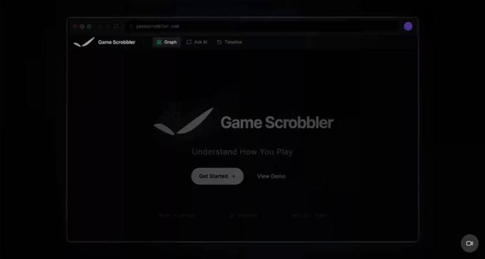
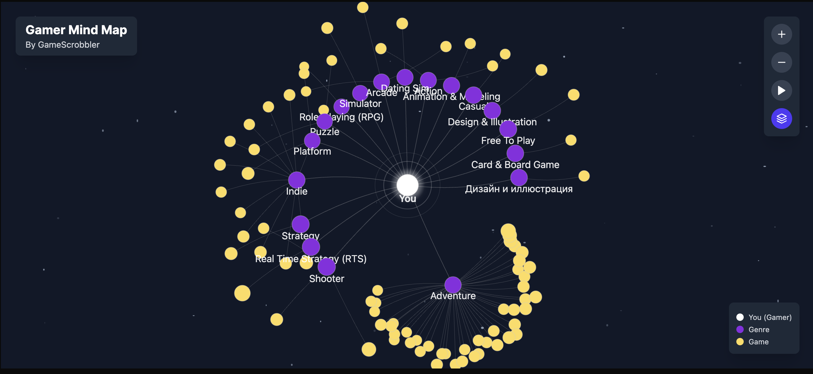
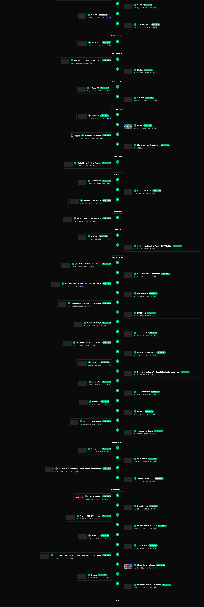
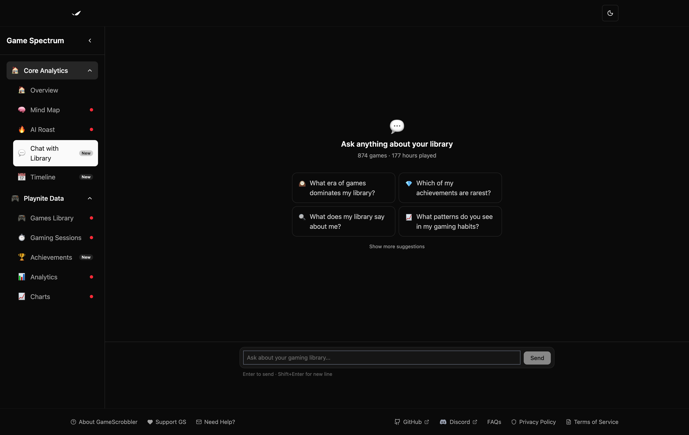
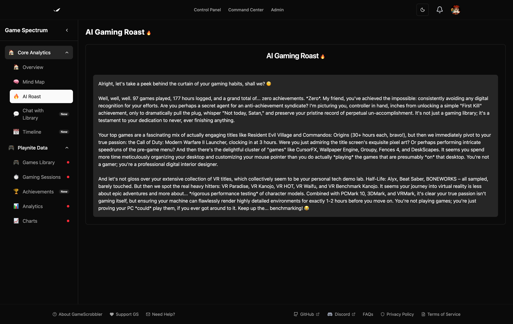

# GameScrobbler — Playnite Plugin

[](https://github.com/game-scrobbler/gs-playnite/blob/main/LICENSE)
[](https://github.com/game-scrobbler/gs-playnite/releases/latest)
[](https://github.com/game-scrobbler/gs-playnite/releases)
[](https://github.com/game-scrobbler/gs-playnite/actions)
[](https://github.com/game-scrobbler/gs-playnite/issues/)
[](https://github.com/game-scrobbler/gs-playnite/pulls/)
[](https://github.com/game-scrobbler/gs-playnite/graphs/contributors/)
[](https://dotnet.microsoft.com/download/dotnet-framework)
[](https://discord.gg/ynEGCAEBun)

Track, analyze, and visualize your gaming life — like Last.fm, but for games.

[GameScrobbler](https://gamescrobbler.com) is the official Playnite plugin for the GameScrobbler platform. It automatically tracks your play sessions, syncs your library, and turns your gaming data into interactive analytics, visual maps, and AI-powered insights.

Instead of a static list of games, your library becomes a living profile of how you actually play — across every platform Playnite manages.

<p align="center">
  <a href="https://www.youtube.com/watch?v=aIkQVpO8NoA">
    
  </a>
</p>

---

## Install

### Install from Playnite (recommended)

1. Open Playnite
2. Go to Addons -> Browse
3. Search `GameScrobbler`
4. Click **Install**

### Manual installation

Download the latest `.pext` from the [releases page](https://github.com/game-scrobbler/gs-playnite/releases/latest), then install via `Playnite -> Addons -> Install from file`.

---

## Supported Platforms

Playnite aggregates games from many launchers. GameScrobbler tracks everything Playnite sees, including games from:

Steam, GOG, Epic Games, Xbox, PlayStation, Battle.net, Ubisoft Connect, itch.io, Humble, Amazon Games, and more.

Official Playnite library plugins are supported by plugin ID. Recognized OSS/forked library plugins are also supported when Playnite exposes a known source name such as GOG OSS, Legendary, Epic Games, or Amazon Games. Manual/custom games without a library plugin are not synced.

You can also link your GameScrobbler account to Steam and Discord at [gamescrobbler.com](https://gamescrobbler.com), with more platforms coming soon.

---

## Features

All features are accessible inside Playnite through the embedded sidebar dashboard and on the web at [gamescrobbler.com](https://gamescrobbler.com).

### Universe

Interactive graph visualizations of your gaming library. Games, genres, platforms, companies, and themes form a force-directed network that reveals your play patterns at a glance.

### Play Timeline

Track your gaming sessions over time. See when you were most active, which games dominated specific periods, and how your habits evolve.

### Dossier

AI-generated gaming personality profile. GameScrobbler analyzes your play history and produces an archetype, playstyle breakdown, and personality insights.

### Chat With Your Library

Ask natural language questions about your gaming habits.

Examples:

- What genre do I play the most?
- Which games did I abandon halfway?
- What should I finish next?

### For You

Personalized game recommendations based on your library and play patterns, with similarity scores and reasons for each suggestion.

### AI Roast

Humorous AI-generated commentary about your gaming habits.

> You own 287 games.
> You have finished 19.
> Your backlog now qualifies as a museum.

### Stats

17 analytics charts covering genres, themes, platforms, companies, franchises, release years, game modes, playtime trends, and more.

### Library

Full game collection view with achievement rarity tracking, sortable by playtime, and switchable between grid and table layouts.

### Social

Steam friends, Discord servers, and linked accounts — all visible in one place.

---

## Screenshots

### Universe (Mind Map)



### Play Timeline



### Chat With Library



### AI Roast



---

## How It Works

1. You play a game — the plugin records the session automatically
2. Your library, playtime, and achievements sync to GameScrobbler in bounded batches
3. AI and analytics generate insights, visualizations, and recommendations
4. View everything in Playnite's sidebar or at [gamescrobbler.com](https://gamescrobbler.com)

Link your GameScrobbler account to connect data from other platforms (Steam, Xbox, PlayStation, etc.) into one unified profile.

### Reliable synchronization

- Full library and achievement uploads are divided into chunks, preventing large Playnite libraries from producing oversized requests.
- Later syncs compare compact local fingerprints and send only added, changed, or removed entries.
- Failed chunked uploads are aborted without replacing the last known-good local baseline, so the next sync can retry safely.
- A queued upload is confirmed before its local baseline is accepted. Failed or unconfirmed jobs retain the previous baseline for the next sync attempt.
- Session starts and stops are saved before network requests, and shutdown saves all active sessions before waiting on the server.
- Achievement read failures postpone the upload instead of clearing previously synced achievements.
- Existing installations migrate their legacy local sync snapshot automatically. This migration affects only plugin state on your computer and does not delete library or achievement data.
- Sync writes use the server-issued install token. On first startup, registration completes before the initial library sync begins.

---

## Public API & MCP

GameScrobbler exposes a read-only public API and an MCP server for AI agents.

### REST API

Base URL: `https://api.gamescrobbler.com/api/v1/public`

| Endpoint | Description |
| --- | --- |
| `GET /library/{token}` | Paginated game library |
| `GET /insights/{token}` | Player archetype, stats, top genres |
| `GET /recommendations/{token}` | Personalized game recommendations |
| `GET /mind-map/{token}` | Force-directed graph of your gaming profile |
| `GET /docs` | Interactive API documentation |
| `GET /openapi.json` | OpenAPI 3.0.3 specification |

Authentication is via a profile token (no API key needed). Rate limit: 30 requests per minute.

### MCP Server

Endpoint: `POST https://api.gamescrobbler.com/api/v1/public/mcp`

Provides 5 tools for AI agents: `get_game_library`, `get_player_insights`, `get_recommendations`, `get_mind_map`, and `get_profile_summary`. Compatible with Claude, ChatGPT, and other MCP clients.

Auth via `x-profile-token` header or `profile_token` parameter.

---

## Theme Integration

The dashboard is exposed as a custom element, so theme developers can place it anywhere in a **Desktop or Fullscreen** theme. This is how GameScrobbler becomes usable in Fullscreen mode, which has no sidebar.

Add this to your theme XAML:

```xml
<ContentControl x:Name="GameScrobbler_Dashboard" />
```

Playnite renders the dashboard wherever you place the control, and your layout controls its position and size. Nothing else is required: no configuration, and no reference to the plugin assembly.

Notes:

- The element resolves only when the Game Scrobbler plugin is installed and enabled. If the user has opted out of data collection, the control renders nothing.
- The same dashboard is used on every surface (sidebar, Extensions menu, and your theme), so users see consistent content wherever it appears.
- The control disposes itself when unloaded, so theme reloads and view changes are safe.

**Current limitation:** this embeds the *whole* dashboard as a single web view. You can position and size it, but you cannot restyle its internals or place individual pieces (the Dossier board, the AI Roast text, specific stats) separately in your theme's own visual language.

Finer-grained integration is being scoped in [#74](https://github.com/game-scrobbler/gs-playnite/issues/74), either as native WPF widgets that inherit your theme's styles or as bindable data you render yourself. If you build themes, that issue is the place to say which pieces you want and which of the two approaches suits you.

---

## Achievement Sync

GameScrobbler can aggregate achievement progress from multiple Playnite addons.

Supported providers:

- [SuccessStory](https://playnite.link/addons.html#Success_Story_Addon)
- [Playnite Achievements](https://playnite.link/addons.html#PlayniteAchievements_e6aad2c9-6e06-4d8d-ac55-ac3b252b5f7b)

The plugin checks providers in priority order and uses the first one that returns data. If neither addon is installed, achievement fields are sent as unknown, not zero.

You can disable achievement sync in `Settings -> Experimental Features -> Sync achievement data`.

---

## Localization

The plugin UI is fully localized. Playnite automatically selects the matching language file based on your system locale.

| Language | Locale | Contributors |
| --- | --- | --- |
| English | `en_US` | Default |
| Russian | `ru_RU` | [@godOFslaves](https://github.com/godOFslaves) |
| Portuguese (Brazil) | `pt_BR` | — |
| German | `de_DE` | — |
| French | `fr_FR` | — |
| Chinese (Simplified) | `zh_CN` | — |
| Hindi | `hi_IN` | — |

Want to add a language or fix a translation? See [`Localization/`](Localization/) — each file is a standalone XAML resource dictionary with 117 string keys.

---

## Privacy

GameScrobbler is [open source](https://github.com/game-scrobbler/gs-playnite) — you can audit exactly what data is collected and sent.

Settings allow you to:

- disable scrobbling entirely
- disable error reporting
- disable achievement syncing
- **delete all your data** from GameScrobbler servers (permanently removes server-side data and disables the plugin)
- opt back in at any time after deletion

All options are configurable inside the plugin settings.

Library synchronization is authenticated with a per-install token stored in Playnite's plugin data directory. Current full-sync requests do not place the installation identity in the request body.

---

## Development

### Requirements

- .NET Framework 4.6.2
- Playnite SDK
- Visual Studio / MSBuild

### Build

```bash
MSBuild.exe GsPlugin.sln -p:Configuration=Release -restore
```

### Tests

```bash
dotnet test GsPlugin.Tests/GsPlugin.Tests.csproj --configuration Release --no-build
```

### Repository Structure

```text
gs-playnite/
├── Api/                — HTTP client, request/response DTOs, circuit breaker
├── Services/           — scrobbling, chunked sync, hashes, achievements
├── Models/             — settings, persistent data, compact sync indexes
├── Infrastructure/     — logging, telemetry, localization, atomic files
├── View/
├── Localization/       — en_US, ru_RU, pt_BR, de_DE, fr_FR, zh_CN, hi_IN
└── GsPlugin.Tests/
```

---

## Release Management

This project uses Release Please with Conventional Commits.

| Commit type | Version bump |
| --- | --- |
| fix | patch |
| feat | minor |
| feat! | major |

Release Please automatically updates version files, generates changelogs, and publishes `.pext` plugin releases.

---

## Contributing

1. Fork the repository
2. Clone your fork
3. Run the setup script to install git hooks:

```powershell
powershell -ExecutionPolicy Bypass -File scripts/setup-hooks.ps1
```

4. All commits must follow [Conventional Commits](https://www.conventionalcommits.org/) (enforced by the `commit-msg` hook).

---

## Links

- [GameScrobbler](https://gamescrobbler.com)
- [Repository](https://github.com/game-scrobbler/gs-playnite)
- [Issues](https://github.com/game-scrobbler/gs-playnite/issues)
- [Discord](https://discord.gg/ynEGCAEBun)
- [Playnite](https://playnite.link)
- [API Documentation](https://api.gamescrobbler.com/api/v1/public/docs)
